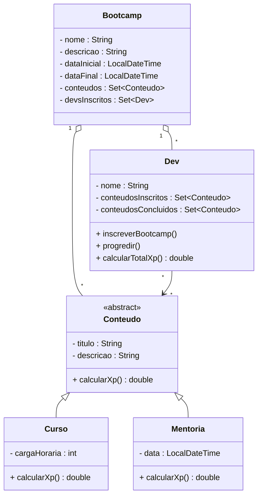

# 🚀 Desafio POO – Bootcamp Java Developer

Projeto desenvolvido em **Java** com foco em **Programação Orientada a Objetos (POO)**, aplicando conceitos fundamentais como **abstração, encapsulamento, herança e polimorfismo**, seguindo um modelo próximo ao utilizado no mercado.

O sistema simula um **bootcamp de programação**, onde desenvolvedores se inscrevem em conteúdos (cursos e mentorias), progridem ao longo do tempo e acumulam **experiência (XP)**.

---

## 📂 Estrutura do Projeto

```text
com.projetos
 ├── Main.java
 └── dominio
     ├── Bootcamp.java
     ├── Conteudo.java
     ├── Curso.java
     ├── Mentoria.java
     └── Dev.java
```

---

## 🧠 Conceitos de POO Aplicados

- Abstração  
- Encapsulamento  
- Herança  
- Polimorfismo  
- Sobrescrita de métodos  
- Classes abstratas  
- Coleções (`Set`, `LinkedHashSet`)  
- Stream API  
- API de Datas (`LocalDateTime`)  

---

## 📐 Modelagem de Domínio

### 🔹 Conteudo (Classe Abstrata)

Classe base para todos os conteúdos do bootcamp.

**Responsabilidades:**
- Definir `titulo` e `descricao`
- Centralizar o XP padrão
- Forçar a implementação do método de cálculo de XP

```java
public abstract double calcularXp();
```

---

### 🔹 Curso

Representa um curso do bootcamp.

**Características:**
- Herda de `Conteudo`
- Possui carga horária
- XP calculado de forma proporcional

**Regra de XP:**
```text
XP_PADRAO * cargaHoraria
```

---

### 🔹 Mentoria

Representa uma mentoria com data definida.

**Características:**
- Herda de `Conteudo`
- Possui data (`LocalDateTime`)
- XP fixo adicional

**Regra de XP:**
```text
XP_PADRAO + bônus fixo
```

---

### 🔹 Bootcamp

Representa o programa de aprendizado.

**Características:**
- Nome e descrição
- Data inicial automática
- Data final com duração de 45 dias
- Lista de conteúdos
- Lista de desenvolvedores inscritos

---

### 🔹 Dev

Representa o desenvolvedor participante do bootcamp.

**Funcionalidades:**
- Inscrição em bootcamp
- Progressão de conteúdos
- Controle de conteúdos inscritos e concluídos
- Cálculo do XP total usando Stream API

---

## 📊 Diagrama de Classes



---

## ▶️ Execução do Projeto

A classe `Main` demonstra:

- Criação de cursos e mentorias  
- Uso de polimorfismo com `Conteudo`  
- Formatação de datas com `DateTimeFormatter`  
- Inscrição de desenvolvedor no bootcamp  
- Progressão de conteúdos  
- Cálculo e exibição do XP total  
- Logs organizados no console  

---

## 🛠 Tecnologias Utilizadas

- Java 17+
- IntelliJ IDEA
- Git
- GitHub
- API `java.time`

---

## 🚧 Possíveis Evoluções

- API REST com Spring Boot  
- Persistência com JPA / Hibernate  
- DTOs para desacoplamento  
- Testes unitários com JUnit  
- Logs profissionais com SLF4J  

---

## 👨‍💻 Autor

### Norwal Gomes

Projeto desenvolvido para estudo e prática de **POO em Java**, seguindo padrões próximos aos utilizados no mercado profissional.

📌 Ideal para portfólio e bootcamps de desenvolvimento Java.
